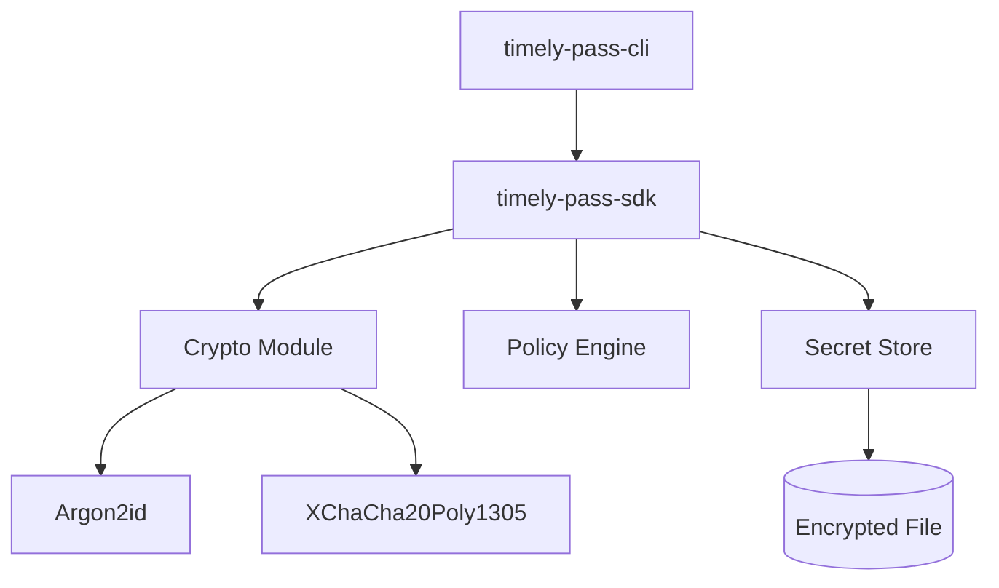

# Architecture

Timely Pass is designed as a modular system consisting of a core SDK and a consumer CLI.

## High-Level Overview

## Modules

### 1. `timely-pass-sdk` (Core Library)
The SDK encapsulates all business logic, security primitives, and data management. It is designed to be embedded in other Rust applications.

- **`crypto`**: Handles all cryptographic operations.
  - Wraps `argon2` for password hashing and KDF.
  - Wraps `chacha20poly1305` for authenticated encryption.
  - Implements `Secret` and `MasterKey` types with `zeroize` traits to ensure secrets are wiped from memory on drop.
- **`policy`**: Defines the policy structure and serialization (TOML).
  - Implements the `Policy`, `Period`, and `Hook` structs.
- **`eval`**: The policy evaluation engine.
  - Takes a `Policy` and an `EvaluationContext` (time, usage stats).
  - Returns a `Verdict` (Accept/Reject) and detailed reasons.
- **`store`**: Manages the persistence layer.
  - Handles secure reading/writing of the encrypted store file.
  - Implements atomic writes using temporary files to prevent data corruption.
  - Manages the `Credential` inventory.

### 2. `timely-pass-cli` (Command Line Interface)
A thin wrapper around the SDK, built using `clap`. It handles:
- Argument parsing.
- User interaction (prompts for passwords).
- Formatting output (tables, JSON).
- File I/O for policy files.

## Data Flow

### Reading a Credential
1. **User** invokes `timely-pass get --id <ID>`.
2. **CLI** prompts for the store passphrase.
3. **SDK** derives the `MasterKey` from the passphrase + Salt (stored in file header) using Argon2id.
4. **SDK** reads the file header (plaintext, contains salt/version).
5. **SDK** decrypts the payload using the `MasterKey`.
6. **SDK** deserializes the payload (Bincode) into a `SecretStore` struct.
7. **SDK** looks up the credential by ID.
8. **SDK** evaluates the attached policy (if any) against the current time.
9. If **Allowed**:
   - **SDK** increments the usage counter.
   - **SDK** re-encrypts and saves the store.
   - **CLI** prints the secret.
10. If **Denied**:
    - **CLI** prints the rejection reason.

### Writing a Credential
1. **User** invokes `add`.
2. **SDK** decrypts the store (as above).
3. **SDK** adds the new credential to the in-memory HashMap.
4. **SDK** serializes the updated store.
5. **SDK** encrypts the new payload with a fresh Nonce.
6. **SDK** writes to a temporary file, then atomically renames it to the target path.
